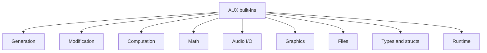

# AUX Function Reference

This reference lists AUX built-in functions and pseudo variables used by the current `aux_engine`, auxlab2, and aux2 workflows. It separates active current behavior from legacy AUXLAB material and omits stale Windows-only GUI behavior.

## 1. Conventions

| Notation | Meaning |
|---|---|
| `x`, `y` | Numeric vector, matrix, or audio object |
| `a`, `b` | Scalar or numeric object |
| `aud` | Audio object |
| `tsq` | Time sequence |
| `h` | Handle object |
| `str` | Text string |
| `[]` | Optional or empty value, depending on context |

Most functions use ordinary function-call syntax:

```aux
y = function_name(arg1, arg2);
```

Many object-oriented operations also support method syntax:

```aux
y = x.function_name(arg1, arg2);
h.stop();
```

## 2. Type and Object Summary

| Type | Description |
|---|---|
| `NUL` | Null or empty value |
| `SCAL` | Scalar number |
| `VECT` | Vector or matrix |
| `TEXT` | String |
| `AUD` | Audio object |
| `CELL` | Cell object |
| `CLAS` | Struct/class-like object |
| `TSEQ` | Time sequence |
| `HAUD` | Audio playback/recording handle |
| `HGO` | Graphics object handle |

## 3. Signal and Vector Generation

| Function | Form | Description |
|---|---|---|
| `tone` | `tone(freq, dur)` | Generate a sinusoidal tone. Duration is in ms. |
| `noise` | `noise(dur)` | Generate noise. |
| `gnoise` | `gnoise(dur)` | Generate Gaussian noise. |
| `dc` | `dc(value, dur)` | Generate a constant-valued audio signal. |
| `silence` | `silence(dur)` | Generate silence. |
| `wave` | `wave(filename)` | Read an audio waveform file. |
| `ones` | `ones(n)`, `ones(r,c)` | Create an array of ones. |
| `zeros` | `zeros(n)`, `zeros(r,c)` | Create an array of zeros. |
| `rand` | `rand(...)` | Generate random values. |
| `irand` | `irand(...)` | Generate integer random values. |
| `randperm` | `randperm(n)` | Generate a random permutation. |
| `cell` | `cell(...)` | Create a cell object. |
| `input` | `input(prompt)` | Read user input. |
| `sprintf` | `sprintf(format, ...)` | Format text and return it as a string. |
| `str2num` | `str2num(str)` | Convert text to numeric value when possible. |

## 4. Signal, Vector, and Matrix Modification

| Function | Form | Description |
|---|---|---|
| `audio` | `audio(x)` | Convert compatible data to an audio object. |
| `vector` | `vector(x)` | Convert compatible data to a vector. |
| `matrix` | `matrix(x, ...)` | Convert or reshape compatible data to a matrix. |
| `group` | `group(...)` | Group values into a composite object. |
| `ungroup` | `ungroup(x)` | Ungroup a composite object. |
| `left` | `left(aud)` | Extract left channel. |
| `right` | `right(aud)` | Extract right channel. |
| `ramp` | `ramp(...)` | Apply or generate a ramp. |
| `sam` | `sam(...)` | Sample/amplitude manipulation utility. |
| `interp` | `interp(x, ...)` | Interpolate data. |
| `resample` | `resample(aud, fs)` | Resample audio. |
| `sort` | `sort(x)` | Sort values. |
| `filt` | `filt(x, b, a)` | Filter with coefficients. |
| `filtfilt` | `filtfilt(x, b, a)` | Zero-phase forward/backward filtering. |
| `conv` | `conv(x, y)` | Convolution. |
| `lpf` | `lpf(x, ...)` | Low-pass filtering. |
| `hpf` | `hpf(x, ...)` | High-pass filtering. |
| `bpf` | `bpf(x, ...)` | Band-pass filtering. |
| `bsf`, `bps` | `bsf(x, ...)` | Band-stop filtering where available. |
| `hamming` | `hamming(n)` | Hamming window. |
| `hann` | `hann(n)` | Hann window. |
| `blackman` | `blackman(n)` | Blackman window. |
| `movespec` | `movespec(aud, hz)` | Shift spectral components. |
| `timestretch` | `timestretch(aud, factor)` | Change duration without simple respeeding. |
| `pitchscale` | `pitchscale(aud, amount)` | Change pitch. |
| `respeed` | `respeed(aud, factor)` | Change speed, affecting duration and pitch. |

Related operators:

| Operator | Function-like meaning |
|---|---|
| `x @ level` | dB/RMS scaling |
| `x @@ delta` | Relative dB change |
| `x >> ms` | Time shift |
| `x -> hz` | Frequency shift |
| `x <> dur` | Duration change |
| `x # amount` | Pitch change |

## 5. Computation and Statistics

| Function | Form | Description |
|---|---|---|
| `length` | `length(x)` | Number of elements or samples. |
| `size` | `size(x)` | Size/dimensions. |
| `min` | `min(x)` | Minimum value. |
| `max` | `max(x)` | Maximum value. |
| `sum` | `sum(x)` | Sum of values. |
| `mean` | `mean(x)` | Mean value. |
| `stdev` | `stdev(x)` | Standard deviation. |
| `std` | `std(x)` | Standard deviation alias where available. |
| `_min` | `_min(x)` | Internal or aggregate minimum variant. |
| `_max` | `_max(x)` | Internal or aggregate maximum variant. |
| `_sum` | `_sum(x)` | Internal or aggregate sum variant. |
| `_mean` | `_mean(x)` | Internal or aggregate mean variant. |
| `_stdev` | `_stdev(x)` | Internal or aggregate stdev variant. |
| `rms` | `rms(aud)` | RMS level. |
| `rmsall` | `rmsall(aud)` | RMS over all available audio data. |
| `begint` | `begint(aud)` | Beginning time of audio. |
| `endt` | `endt(aud)` | Ending time of audio. |
| `dur` | `dur(aud)` | Duration in ms. |
| `atleast` | `atleast(x, minValue)` | Clamp to at least a value. |
| `atmost` | `atmost(x, maxValue)` | Clamp to at most a value. |
| `diff` | `diff(x)` | Difference between adjacent values. |
| `cumsum` | `cumsum(x)` | Cumulative sum. |
| `fft` | `fft(x)` | Fast Fourier transform. |
| `ifft` | `ifft(x)` | Inverse FFT. |
| `hilbert` | `hilbert(x)` | Hilbert transform. |
| `envelope`, `envlope` | `envelope(aud)` | Estimate or extract envelope. |

## 6. Math Functions

| Function | Description |
|---|---|
| `abs` | Absolute value or magnitude |
| `acos` | Inverse cosine |
| `asin` | Inverse sine |
| `atan` | Inverse tangent |
| `angle` | Phase angle |
| `ceil` | Ceiling |
| `conj` | Complex conjugate |
| `cos` | Cosine |
| `exp` | Exponential |
| `fix` | Round toward zero |
| `floor` | Floor |
| `imag` | Imaginary part |
| `log` | Natural logarithm |
| `log10` | Base-10 logarithm |
| `mod` | Modulus |
| `pow` | Power |
| `real` | Real part |
| `round` | Round to nearest |
| `sign` | Sign |
| `sin` | Sine |
| `sqrt` | Square root |
| `tan` | Tangent |

## 7. Time Sequence Functions

| Function | Form | Description |
|---|---|---|
| `tsq_gettimes` | `tsq_gettimes(tsq)` | Return time points. |
| `tsq_getvalues` | `tsq_getvalues(tsq)` | Return values. |
| `tsq_settimes` | `tsq_settimes(tsq, times)` | Replace time points. |
| `tsq_setvalues` | `tsq_setvalues(tsq, values)` | Replace values. |
| `tsq_isrel` | `tsq_isrel(tsq)` | Return whether the sequence is relative. |

Example:

```aux
ts = [0 .5 1;][0 -12 0];
y = x @ ts;
```

## 8. Audio Playback and Recording

| Function | Form | Description |
|---|---|---|
| `play` | `play(aud)` | Play audio and return a playback handle. |
| `play` | `play(aud, repeat)` | Play audio repeatedly. |
| `play` | `play(handle, aud)` | Reuse/update playback through a handle. |
| `pause` | `pause(handle)` | Pause playback or recording. |
| `resume` | `resume(handle)` | Resume playback or recording. |
| `stop` | `stop(handle)` | Stop playback or recording. |
| `qstop` | `qstop(...)` | Quick stop where supported. |
| `status` | `status(handle)` | Return status where supported. |
| `record` | `record(dev, dur, channels)` | Synchronous recording. |
| `record` | `record(dev, dur, channels, block).callback` | Asynchronous recording with callback UDF. |

For callback recording, `dur` may be `-1` for indefinite recording, `channels` is currently limited to `1` or `2`, and `block` must be positive. The suffix after the dot is the callback UDF name.

Playback handle members:

| Member | Meaning |
|---|---|
| `fs` | Sampling rate |
| `dur` | Duration in ms |
| `repeat_left` | Repeats remaining |
| `prog` | Progress |

Recording handle members:

| Member | Meaning |
|---|---|
| `type` | Handle type |
| `id` | Runtime handle id |
| `devID` | Input device id |
| `fs` | Sampling rate |
| `channels` | Channel count |
| `dur` | Requested duration |
| `block` | Callback block duration |
| `durRec` | Recorded duration |
| `durLeft` | Remaining duration |
| `prog` | Progress |
| `active` | Active flag |
| `paused` | Paused flag |

Callback UDF input:

| Member | Meaning |
|---|---|
| `in.?index` | Callback index. `0` is setup; later indices contain recorded blocks. |
| `in.?fs` | AUX sample rate for callback data. |
| `in.?data` | Current audio block. |

Callback UDF outputs persist across invocations in a single recording session. This is intentional and lets a callback maintain accumulated audio, graphics handles, or analysis state without globals.

## 9. Graphics Functions

Graphics functions require a front end that supports graphics, such as auxlab2.

| Function | Form | Description |
|---|---|---|
| `figure` | `figure()`, `figure(name)`, `figure(rect)` | Create or select a figure. |
| `axes` | `axes()`, `axes(rect)` | Create or select axes. |
| `plot` | `plot(y)`, `plot(x,y)`, `plot(ax,...)` | Plot numeric data. |
| `line` | `line(y)`, `line(x,y)`, `line(ax,...)` | Create line graphics object. |
| `text` | `text(x,y,str)`, `text(ax,x,y,str)` | Create text annotation. |
| `delete` | `delete(h)` | Delete graphics object. |

Method syntax examples:

```aux
h = figure("demo");
ax = h.axes();
ax.plot([1 3 2 5], "go:");
ax.text(.2, .8, "label");
```

Pseudo variables:

| Pseudo variable | Meaning |
|---|---|
| `gcf` | Current figure |
| `gca` | Current axes |

## 10. Logical and Type Functions

| Function | Description |
|---|---|
| `and` | Logical AND |
| `or` | Logical OR |
| `isempty` | True if value is empty |
| `isaudio` | True for audio objects |
| `isvector` | True for vector/matrix-like values |
| `isstring` | True for text strings |
| `isstereo` | True for stereo audio |
| `isbool` | True for boolean values |
| `iscell` | True for cell objects |
| `isclass` | True for class/struct-like objects |
| `istseq` | True for time sequences |
| `ismember` | True if member/key exists or item is present |
| `issame` | True if objects are the same by comparison rules |

## 11. Struct, Cell, and Member Functions

| Function | Form | Description |
|---|---|---|
| `members` | `members(obj)` | List members of a struct/class-like object. |
| `ismember` | `ismember(obj, name)` | Test whether a member exists. |
| `erase` | `erase(obj, name)` | Erase a member or entry where supported. |
| `head` | `head(obj)` | Return head/header information where supported. |
| `squeeze` | `squeeze(x)` | Remove singleton dimensions or simplify structure. |

Member access uses dot syntax:

```aux
rh.fs
rh.active
```

Some callback and runtime objects use query-style member names:

```aux
in.?index
in.?data
```

## 12. File and Data I/O

| Function | Form | Description |
|---|---|---|
| `dir` | `dir(path)` | List directory contents. |
| `fopen` | `fopen(filename, mode)` | Open a file. |
| `fclose` | `fclose(fid)` | Close a file. |
| `fprintf` | `fprintf(fid, format, ...)` | Write formatted text to file. |
| `printf` | `printf(format, ...)` | Print formatted text to console. |
| `fread` | `fread(fid, ...)` | Read from file. |
| `fwrite` | `fwrite(fid, data)` | Write to file. |
| `filepointer` | `filepointer(fid)` | Get or manage file pointer where supported. |
| `file` | `file(filename)` | File utility or object creation. |
| `fget` | `fget(fid)` | Read/get file content or item. |
| `fdelete` | `fdelete(filename)` | Delete file. |
| `write` | `write(filename, data)` | Write data to file. |
| `wavwrite` | `wavwrite(aud, filename)` | Write audio to waveform file. |
| `json` | `json(...)` | JSON parsing or formatting utility. |
| `include` | `include(filename)` | Include and evaluate AUX source. |

## 13. Runtime and Miscellaneous Functions

| Function | Form | Description |
|---|---|---|
| `clear` | `clear`, `clear(name)` | Clear workspace values. |
| `dtype`, `otype` | `dtype(x)` | Return data/object type information. |
| `eval` | `eval(str)` | Evaluate AUX text. |
| `getfs` | `getfs()` | Return current sampling rate. |
| `setfs` | `setfs(fs)` | Set current sampling rate. |
| `tic` | `tic()` | Start timer. |
| `toc` | `toc()` | Read elapsed time. |
| `inputdlg` | `inputdlg(...)` | GUI input dialog where supported. |
| `msgbox` | `msgbox(...)` | GUI message box where supported. |
| `error` | `error(message)` | Raise an error. |
| `warning` | `warning(message)` | Emit a warning. |
| `setnextchan` | `setnextchan(...)` | Channel routing utility where supported. |
| `face` | `face(...)` | Runtime/front-end utility. |
| `rend` | `rend(...)` | Rendering/runtime utility. |
| `test` | `test(...)` | Development or diagnostic helper. |

## 14. Pseudo Variables

| Name | Meaning |
|---|---|
| `i` | Imaginary unit |
| `j` | Imaginary unit |
| `e` | Euler's number |
| `pi` | Pi |
| `inf` | Infinity |
| `nan` | Not-a-number |
| `true` | Boolean true |
| `false` | Boolean false |
| `gcf` | Current figure |
| `gca` | Current axes |

Legacy AUXLAB documentation sometimes displayed pseudo variables with a `$` prefix. Current AUX code generally uses the names directly.

## 15. aux2 App-Control Commands

These commands are typed at the aux2 prompt and begin with `>`.

| Command | Description |
|---|---|
| `> udfpath` | Show UDF search paths. |
| `> udfpath :a path` | Add a UDF search path. |
| `> udfpath :r path` | Remove a UDF search path. |
| `> udf full_path` | Register/load a UDF file. |
| `> precision` | Show display precision. |
| `> precision n` | Set display precision. |
| `> debug udf line...` | Set debug breakpoints for a UDF. |

During a debug pause in aux2:

| Command | Description |
|---|---|
| `/s` | Step |
| `/c` | Continue |
| `/x` | Abort |

Shell commands can be run from aux2 with `#`:

```text
#pwd
#cd /tmp
#ls
```

## 16. Function Category Map



Figure 1. High-level organization of AUX built-in functions.
