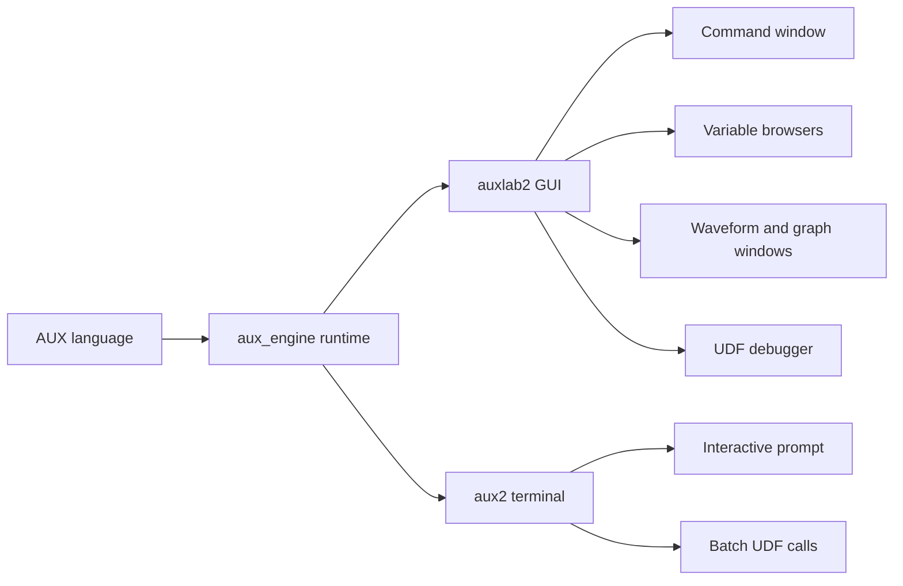
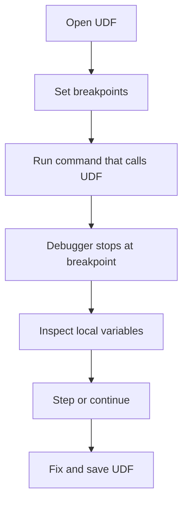
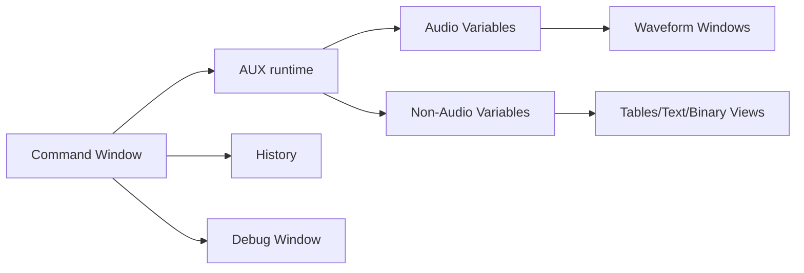
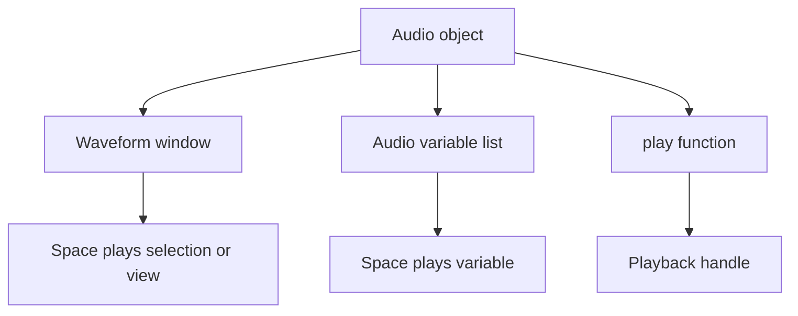

# AUX and auxlab2 User Guide

This guide covers AUX as the core language and auxlab2 as the current graphical environment. It is based on the legacy AUXLAB 1.701 documentation, the current `aux_engine` implementation, and the current `auxlab2` interface behavior.

Legacy AUXLAB for Windows features that are no longer part of the active auxlab2 workflow are intentionally omitted.

## 1. What AUX Is

AUX is an audio-oriented numeric scripting language with MATLAB-like syntax. It is designed for fast interactive experiments with vectors, matrices, audio objects, time-varying controls, file I/O, graphics, and user-defined functions.

There are two current ways to use AUX:

| Program | Best for | Notes |
|---|---|---|
| `auxlab2` | Interactive work, graphics, waveform display, playback, recording, and UDF debugging | Full GUI environment |
| `aux2` | Batch jobs, terminal use, scripts that do not require graphics | Lightweight command-line program |



Figure 1. AUX is the shared language/runtime. auxlab2 and aux2 are front ends.

## 2. Quick Start

### 2.1 Interactive Commands

At an AUX prompt, type an expression or statement:

```aux
x = tone(440, 500);
play(x);
```

This creates a 440 Hz tone with a duration of 500 ms and plays it.

Use a semicolon to suppress display output:

```aux
x = noise(1000);
```

### 2.2 A First Audio Example

```aux
fs = 16000;
t = (0:7999) / fs;
x = sin(2*pi*440*t);
y = x @ -12;
play(y);
```

This creates a sampled sine wave, scales it to approximately `-12` dB RMS using AUX's audio gain operator, and plays it.

### 2.3 A First Stereo Example

```aux
left = tone(440, 500);
right = tone(660, 500);
st = [left; right];
play(st);
```

In AUX, `[left; right]` creates a two-channel audio object when the operands are audio signals.

## 3. Data Types

AUX values have runtime types. The most common types are shown below.

| Type | Meaning | Example |
|---|---|---|
| `NUL` | Empty/null value | `[]` |
| `SCAL` | Scalar number, real or complex | `3.14`, `2+3*i` |
| `VECT` | Vector or matrix | `[1 2 3]`, `[1 2; 3 4]` |
| `TEXT` | String | `"hello"` |
| `AUD` | Audio signal with sampling rate and timing metadata | `tone(440, 500)` |
| `CELL` | Heterogeneous collection | `cell(1, "a", tone(440,100))` |
| `CLAS` | Struct/class-like object with members | Returned by many handle functions |
| `TSEQ` | Time sequence for time-varying control | `[0 .5 1;][0 -6 -12]` |
| `HAUD` | Audio playback or recording handle | Returned by `play` or async `record` |
| `HGO` | Graphics object handle | Returned by `figure`, `axes`, `plot`, etc. |

Use the type-checking functions when code needs to validate input:

```aux
isaudio(x)
isvector(x)
isstring(x)
iscell(x)
isclass(x)
istseq(x)
isempty(x)
```

## 4. Variables, Vectors, Matrices, and Audio

### 4.1 Assignment

```aux
a = 10;
b = [1 2 3 4];
c = [1 2; 3 4];
```

Assignment creates or replaces a variable in the current workspace.

Compound assignment is supported:

```aux
x += 1;
x *= 2;
```

AUX also supports compound forms for AUX-specific operators, such as `@=`, `@@=`, `>>=`, `~=`, `->=`, `<>=`, and `#=`.

### 4.2 Vector and Matrix Indexing

AUX indexing is MATLAB-like and 1-based:

```aux
v = [10 20 30];
v(1)       // 10
v(end)     // 30
```

Ranges use `:`:

```aux
v = 1:10;
v(3:6)
```

Matrices use row and column subscripts:

```aux
m = [1 2; 3 4];
m(2,1)     // 3
```

Conditional indexing is useful for numeric cleanup:

```aux
x(x < 0) *= -1;
```

### 4.3 Audio Objects

Audio objects carry samples, sample rate, channel information, and timing metadata.

```aux
x = tone(1000, 250);
dur(x)
getfs(x)
isstereo(x)
```

The current sampling rate is controlled by `setfs` and `getfs`:

```aux
setfs(48000);
fs = getfs();
```

## 5. AUX Operators

AUX includes ordinary numeric operators and audio-specific operators.

| Operator | Meaning | Example |
|---|---|---|
| `+`, `-`, `*`, `/` | Arithmetic | `x = a + b` |
| `^`, `pow` | Power | `x = 2^8` |
| `%`, `mod` | Modulus | `r = mod(10,3)` |
| `&&`, `and` | Logical AND | `a && b` |
| `||`, `or` | Logical OR | `a || b` |
| `!` | Logical NOT | `!done` |
| `++` | Append/concatenate | `x = a ++ b` |
| `@` | Set or apply RMS level in dB | `y = x @ -20` |
| `@@` | Relative dB change | `x @@= 6` |
| `>>` | Time shift in ms | `delayed = x >> 100` |
| `~` | Time indexing or time compression/expansion | `seg = x(100~300)` |
| `->` | Frequency shift | `y = x -> 200` |
| `<>` | Duration change | `y = x <> 1000` |
| `#` | Pitch change | `y = x # 2` |

The audio-specific operators are one of AUX's main differences from MATLAB.

### 5.1 dB Scaling with `@` and `@@`

`@` sets or applies a target RMS level:

```aux
x = tone(440, 500);
y = x @ -18;
```

`@@` applies a relative dB change:

```aux
y = x @@ 6;
```

### 5.2 Time Shifting with `>>`

```aux
x = tone(440, 300);
y = x >> 100;
```

This shifts the audio by 100 ms.

### 5.3 Time Indexing with `~`

For audio objects, `~` indexes time in milliseconds:

```aux
x = wave("speech.wav");
seg = x(500~1200);
```

If the start time is greater than the end time, the segment is reversed:

```aux
backward = x(1200~500);
```

### 5.4 Frequency, Duration, and Pitch Operators

```aux
shifted = x -> 100;     // spectral shift
longer = x <> 2000;     // duration change
pitched = x # 2;        // pitch change
```

For explicit function calls, use `movespec`, `timestretch`, `respeed`, and `pitchscale`.

### 5.5 Replicator `..`

The replicator avoids repeating the left-hand expression during assignment:

```aux
x = .. + 50;
x = sqrt(..);
```

For indexed assignment:

```aux
x(400~500) = .. @ -10;
```

This is useful when the left-hand side is expensive or verbose.

## 6. Time Sequences

A time sequence (`TSEQ`) represents a time-varying control curve.

```aux
ts = [0 .25 .5 1;][0 -6 -12 -3];
y = x @ ts;
```

The first part stores times and the second part stores values. Time sequences can be absolute or relative. Relative time sequences are useful for applying envelopes or level curves over the duration of an audio object.

Useful time-sequence functions:

```aux
tsq_gettimes(ts)
tsq_getvalues(ts)
tsq_settimes(ts, newTimes)
tsq_setvalues(ts, newValues)
tsq_isrel(ts)
```

## 7. Control Flow

AUX supports MATLAB-like control flow.

### 7.1 Conditional Statements

```aux
if rms(x) > -20
    y = x @ -20;
elseif isempty(x)
    y = silence(100);
else
    y = x;
end
```

### 7.2 Loops

```aux
for k = 1:10
    y(k) = k*k;
end
```

```aux
n = 1;
while n < 100
    n *= 2;
end
```

Use `break` and `continue` when needed.

### 7.3 Switch Statements

```aux
switch mode
case "tone"
    x = tone(440, 500);
case "noise"
    x = noise(500);
otherwise
    x = silence(500);
end
```

## 8. Functions and Method Syntax

AUX functions can be called in ordinary form:

```aux
y = filt(x, b, a);
```

Many functions also support method-style syntax:

```aux
y = x.filt(b, a);
```

Handle objects returned by playback, recording, and graphics functions also expose member functions:

```aux
ph = play(x);
ph.pause();
ph.resume();
ph.stop();
```

## 9. User-Defined Functions

User-defined functions are AUX scripts stored in `.aux` files. A UDF is the right tool when a sequence of commands should be reusable, testable, or callable from aux2 batch jobs.

### 9.1 Basic UDF Shape

Create a file named `normalize_audio.aux`:

```aux
function y = normalize_audio(x, level)
    if isempty(level)
        level = -20;
    end
    y = x @ level;
end
```

Call it from the command window:

```aux
y = normalize_audio(x, -18);
```

### 9.2 Multiple Outputs

```aux
function [y, r] = prep_audio(x)
    r = rms(x);
    y = x @ -20;
end
```

Call:

```aux
[y, before] = prep_audio(x);
```

### 9.3 UDF Search Paths

In auxlab2, configure UDF paths from the runtime/settings UI. You can also open files directly with `File > Open UDF` and `File > Open Recent`.

In aux2, use the app-control prompt syntax:

```text
> udfpath
> udfpath :a /path/to/aux/functions
> udfpath :r /path/to/aux/functions
> udf /full/path/to/myfunction.aux
```

### 9.4 Calling a UDF from aux2

Start an interactive aux2 session:

```sh
aux2
```

Then call the function:

```aux
y = normalize_audio(wave("input.wav"), -18);
wavwrite(y, "output.wav");
```

For a one-shot terminal call, pass the `.aux` file name followed by string arguments:

```sh
aux2 process_file.aux input.wav output.wav
```

aux2 evaluates this as:

```aux
process_file("input.wav", "output.wav")
```

This is the recommended pattern for batch jobs that do not need GUI graphics.

## 10. Debugging UDFs in auxlab2

auxlab2 includes a UDF editor/debug window.

| Action | Shortcut |
|---|---|
| Show debug window | `Ctrl+Alt+D` |
| Toggle breakpoint | `F9` |
| Continue | `F5` |
| Step over | `F10` |
| Step in | `F11` |
| Step out | `Shift+F11` |
| Abort to base | `Shift+F5` |
| Save current tab | `Cmd+S` on macOS, `Ctrl+S` elsewhere |

Typical workflow:



Figure 2. UDF debugging loop in auxlab2.

While paused in a UDF, auxlab2 tracks the active debug scope. Variable inspection and stepping operate in that scope. Use `Shift+F5` when you need to abort the current execution and return to the base workspace.

## 11. auxlab2 Interface

auxlab2 is organized around command entry, workspace inspection, command history, signal display, and debugging.



Figure 3. Main auxlab2 GUI components.

| Component | Purpose |
|---|---|
| Command window | Enter and execute AUX commands |
| Audio variable list | Shows audio objects; can open waveform windows or play audio |
| Non-audio variable list | Shows scalars, vectors, matrices, text, binary data, cells, structs, and handles |
| History list | Reuse previous commands |
| Waveform/graph windows | Display audio, vectors, plots, FFT overlays, and selections |
| Table/text/binary windows | Inspect non-audio objects |
| Debug window | Edit and debug UDFs |

### 11.1 Command Window Shortcuts

| Shortcut | Action |
|---|---|
| `Enter` | Execute current command |
| `Up` / `Down` | Navigate command history |
| `Ctrl+R` | Reverse history search |
| `Ctrl+A` | Move to start of editable command |
| `Ctrl+E` | Move to end of line |
| `Ctrl+U` | Clear command line before cursor |
| `Ctrl+K` | Clear command line after cursor |
| `Ctrl+P` / `Ctrl+N` | Previous/next history item |

The command window protects previous output. Editing is limited to the current prompt.

### 11.2 History List

| Action | Result |
|---|---|
| Select and press `Enter` | Inject selected command into the command window |
| Double-click | Inject and execute selected command |

History is persistent across sessions.

### 11.3 Variable Lists

auxlab2 separates audio variables from non-audio variables.

| Location | Action | Result |
|---|---|---|
| Audio variable list | `Enter` | Open waveform/graph window |
| Audio variable list | `Space` | Play selected audio |
| Audio variable list | Double-click | Open detailed table view |
| Non-audio variable list | Double-click vector/matrix | Open table view |
| Non-audio variable list | Double-click text | Open text view |
| Non-audio variable list | Double-click binary | Open binary dump |
| Non-audio variable list | Double-click cell/struct | Open structured view |

### 11.4 Waveform and Graph Windows

Waveform windows show audio in time. Vector and plot windows show numeric data. Audio y-axis display is normally normalized to `[-1, 1]`; non-audio data is auto-fit.

| Shortcut | Action |
|---|---|
| Drag | Select a region |
| `Enter` | Zoom to selected region |
| `+`, `=`, `Up` | Zoom in |
| `-`, `_`, `Down` | Zoom out |
| `Left` / `Right` | Pan |
| `F2` | Toggle stereo display modes |
| `F4` | Toggle FFT overlay |
| `Shift+F4` | Reset FFT pane offsets |
| `Space` | Play selected region or visible region |
| `Space` while playing | Pause/resume playback |
| `Esc` | Stop playback |

### 11.5 Window Management

Use the platform primary key: `Cmd` on macOS, `Ctrl` on Windows/Linux.

| Shortcut | Action |
|---|---|
| Primary+`Tab` | Next scoped window |
| Primary+`Shift+Tab` | Previous scoped window |
| Primary+`1` through Primary+`9` | Focus numbered window |
| Primary+`G` / Primary+`Shift+G` | Next/previous graph window |
| Primary+`T` / Primary+`Shift+T` | Next/previous table window |
| Primary+`` ` `` | Toggle between last two windows |
| Primary+`Shift+W` | Close all windows in scope |
| Primary+`W` in child window | Close child window |

## 12. Playing Audio

There are three main playback paths.



Figure 4. Audio can be played from GUI views or from AUX code.

### 12.1 Play from a Waveform Window

1. Open an audio variable with `Enter` from the audio variable list.
2. Drag to select a time region, or leave no selection to use the visible region.
3. Press `Space` to play.
4. Press `Space` again to pause/resume.
5. Press `Esc` to stop.

### 12.2 Play from the Audio Variable List

Select an audio variable and press `Space`.

This is the fastest way to audition a complete signal.

### 12.3 Play with the `play` Function

```aux
x = tone(440, 1000);
ph = play(x);
```

Repeat playback:

```aux
ph = play(x, 3);
```

Control playback:

```aux
pause(ph);
resume(ph);
stop(ph);
```

or:

```aux
ph.pause();
ph.resume();
ph.stop();
```

Playback handles expose useful members:

| Member | Meaning |
|---|---|
| `fs` | Playback sampling rate |
| `dur` | Duration in ms |
| `repeat_left` | Remaining repeats |
| `prog` | Playback progress |

## 13. Recording Audio

Recording can be synchronous or asynchronous.

### 13.1 Synchronous Recording

```aux
r = record(0, 1000, 1);
```

This records 1000 ms from device `0` with one channel and returns an audio object when recording finishes.

Stereo example:

```aux
r = record(0, 1000, 2);
```

### 13.2 Asynchronous Recording with Callback UDF

Async recording uses a callback UDF. The fourth argument is block size in ms, and the callback is supplied using method syntax:

```aux
rh = record(0, 5000, 1, 100).rec_callback;
```

For indefinite recording:

```aux
rh = record(0, -1, 1, 100).rec_callback;
```

For callback recording, `duration_ms` may be `-1`, `channels` is currently `1` or `2`, and `block_ms` must be positive. The suffix after the dot is the callback UDF name.

The recording handle can be controlled like a playback handle:

```aux
rh.pause();
rh.resume();
rh.stop();
```

Recording handles expose members:

| Member | Meaning |
|---|---|
| `type` | Handle type |
| `id` | Runtime handle id |
| `devID` | Input device id |
| `fs` | Recording sampling rate |
| `channels` | Number of channels |
| `dur` | Requested duration |
| `block` | Callback block size |
| `durRec` | Recorded duration |
| `durLeft` | Remaining duration |
| `prog` | Recording progress |
| `active` | Whether recording is active |
| `paused` | Whether recording is paused |

Example callback UDF:

```aux
function [out] = rec_callback(in)
    if in.?index == 0
        out = [];
    else
        out ++= in.?data;
        printf("block %d rms %f\n", in.?index, rms(in.?data));
    end
end
```

The callback receives a struct-like input:

| Callback input | Meaning |
|---|---|
| `in.?index` | Callback index. `0` is the setup event; `1` and later are audio blocks. |
| `in.?fs` | AUX sample rate used for callback data. |
| `in.?data` | Current audio block. For index `0`, this is an initialization block. |

Callback outputs are persistent for one recording session. Before each callback invocation, auxe restores the previous output values into the callback scope; after the invocation, it saves the updated outputs. This allows a callback to accumulate `out` across blocks without using global variables. Callback-created handles such as figures and axes can also remain reachable through the recording handle when supported by the front end.

## 14. Graphics in auxlab2

Graphics are available in auxlab2 through `figure`, `axes`, `plot`, `line`, `text`, and `delete`.

```aux
v = [1 3 2 5 4];
h = figure("example");
ax = axes([.13 .11 .775 .815]);
plot(ax, v, "r--");
text(ax, .2, .8, "example");
```

Method-style graphics calls are also supported:

```aux
h = figure("method example");
ax = h.axes();
ax.plot(v, "go:");
ax.line(v);
```

Use `gcf` and `gca` for the current figure and axes when appropriate.

For tasks that do not need graphics, waveform windows, or recording/playback GUI integration, use `aux2`.

## 15. Practical Workflows

### 15.1 GUI Exploration

```aux
x = wave("speech.wav");
plot(x);
play(x);
y = x(500~1200) @ -18;
```

Use auxlab2 when you need to inspect variables, zoom into waveforms, compare views, or debug UDFs.

### 15.2 Batch Processing

Create `process_file.aux`:

```aux
function process_file(infile, outfile)
    x = wave(infile);
    y = x @ -20;
    wavwrite(y, outfile);
end
```

Run:

```sh
aux2 process_file.aux input.wav output.wav
```

This keeps repeatable processing outside the GUI.
